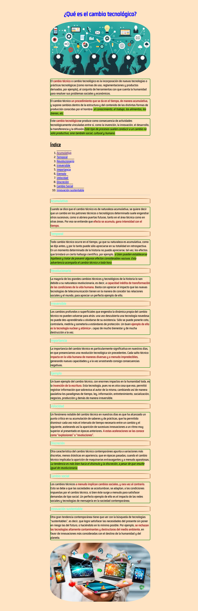
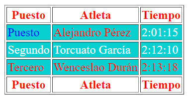

# UF1-A3-DOCUMENTACION-MP4UF1-Apuntes

Repositorio de Juan Gomez apuntes de GITHUB, MARKDOWN, HTML, CSS, y DISEÑO RESPONSIVE

## Introducción: GITHUB

GitHub es un programa gratuito y online que sirve para hacer repositorio que podamos compartir con los demás dicha información de los repositorios y proyectos pueden ser guardados en la nube.

Para poder inicar, comenzamos descargando el Git la cual es una nueva series de controles para GitHub y la instalamos.

Ahora en la web de GitHub creamos un repositorio, le ponemos un nombre, una descripción de lo que se va hacer en el repositorio, también el acceso lo ponemos público y lo muy importante añadimos el README file para poder dar margen y subir información a nuestro repositorio.


Ahora copiamos un enlace de nuestro repositorio creado, en nuestra CD local creamos una carpeta para GitHub, abrimos el cmd seleccionamos la carpeta donde guardaremos y ponemos ("git clone https://github.com/JuanjGomez/UF1-A3-DOCUMENTACION-MP4UF1-Apuntes.git"), así duplicaremos nuestro repositorio de la página de GitHub a nuestro sistema. Ahora podemos usar el Visual Studio Code donce podemos poner información en el README.md y lo podemos subir al repositorio con los siguientes comandos del Git.

Después de escribir la información, entramos a la carpeta de nuestro repositorio clonado y abrimos el cmd. El primer comando es (git init), sirve para hacer una configuración inicial al repositorio.

El segundo comando es (git add readme.md), este sirve para subir una información específica y la ubicación a poner o también (git add .), este otro comando en ves de seleccionar una parte de la informcaión, este selecciona todo para poder subir.

El tercer comando es (git commit -m "Título"), este sirve para capturar los cambios y prepararlo para subirlos además, se le puede poner un título entre comillas para dar un nombre al cambio que le haces.

El último comando para subir la información es (git push origin main), este ejecuta los cambios insertandolo los cambios locales y al repositorio en línea.

## Primer Capítulo: MARKDOWN

Ahora pasamos a los comandos y claves que nos sirven en MarkDown, primero para tener este lenguaje de programación en Visual Studio Code debemos insertalo, hacemos clic en Extensiones y buscamos markdownlint, por último lo instalamos.

Con este lenguaje podemos modificar nuestro texto. Para poder poner nuestro texto en cursiva, *Hay dos formas una es con asteriscos* (*texto*), usando dos asteriscos uno al inicio y otro al final del texto, este se pondra en cursiva automaticamente y _la segunda manera es con guiones bajos_ (_texto_), la otra forma es usando guiones bajos como en los asteriscos uno al inicio y otro al final del texto.

Otro formato para dar al texto es ponerlo en negrita. **También haydos formas de poner en negrita**(**texto**), usando dos veces seguidas el asterisco al inicio y final del texto lo pone en negrita y __esta otra forma también puede funcionar__ (__texto__), con doble guiones bajos al inicio y final del texto sirve para poner en negrita.

También se le puede poner el texto en negrita y cursiva al mismo tiempo ***como este ejemplo de negrita y cursiva*** (***texto***), de esta manera el texto saldrá en negrita y cursiva con tres astericos al inicio y final. ___De esta otra manera también se puede hacer las dos___ (___texto___), de esta otra fomra se puede hacer el texto en cursiva y negrita al inicio y final con tres guiones bajos.

1. Primera opción de menú.
2. Segunda opción de menú.
3. Tercera opción de menú.

De esta forma se puede crear una lista ordenada. Poniendo en orden de secuencia cada uno de los temas.

* Primera opción de lista desordenada.
* Segunda opción de lista desordenada.

_ Tercera opción de lista desordenada.
    1. Primer submenú.
    2. Segundo submenú.

_ Cuarta opción de lista desordenada.
    * Tercer submenú.
    * Cuarto submenú.
+ Quinta opción de lista desordenada.
+ Sexta opción de lista desordenada.

Este es un ejemplo de lista desordenada, en ves de usar números para dar un orden a la lista. Para la lista desordenada se usa (*, _, +), estos simbolos se usa una vez al inicio para comenzar la lista desordenada y dentro de las lista tanto ordenada y desordenada se puede poner submenús, dando al tabulador y también se puede usar partes de una lista ordenada o desordenada como (1, 2, 3, etc, o *, +, _), con estas características podemos abrir en submenús.

```
    <html>
    <head>
    </head>
    <body>
        <p>Esto es un párrafo</p>
    </body>
<html>
```

Este es un ejemplo de etiqueta para HTML, para ayudar a otros usuarios les haga más facíl su trabajo le añadimos tres comillas a la izquierda (``), al inicio, saltamos espacio y al terminar la etiqueta ponemos otras (```), al final, así se podrá copiar y será más sencillo.

[Esto es un enlace](http://joan23.fje.edu "Enlace a la web del cole")

Para añadir un enlace al repositorio se hace de esa manera, ahora al inicio se abre un ([texto]), lo que va dentro de corchete es la forma o texto en la que se ponga el enlace, ahora en el parentesis (enlace "Comentario del enalce"), en esta parte va el enlace y por último se hace un espacio y entre comillas se le añade un comentario que aparecer cuando la se ponga la flecha del mouse sobre esta.


Ahora para poner una imagen y que este a la vez sea una enlace para entrar a otra página, primero se debe guardar una imagen en el carpeta de nuestro repositorio, luego subimos con los comandos del git en el cmd. Para entonces ya tendremos la imagen en nuestro repositorio, vamos ahi, copiamos el enlace de la imagen y acontinuación. se pone un signo de exclamación al inicio, ahora se abre corchete ([Aqui va un nombre a la imagen]), después se abre parentesis (Aqui va pegado el enlace "Comentario de la imagen"), dentro de los parentesis se pone el enlace y seguido entre comillas un comentario que salga de esa enlace-imagen.

|Primera Col.|Segunda Col.|3 Col|
|---------------|:------------:|---------:|
|Col 2 es|Centrada|35€|
|Col 3 es|Derecha|123€|
|Estilo Cebra|Gris|Blanco|
|Clase|ASIX1|M4|

Ahora la introducción de tablas, en la primera línea como hroizontal van los nombres, en la segunda los guiones representa la cantidad de espacio que de da a cada uno también se puede alinear el texto al centro, izquierda y derecha. por ejemplo (|---------|) es izquierda, (:--------:) es centrada, (--------:) es derecha. Después de eso se pone la información en cada una de las columnas de la manera vertical, siempre dando margen con | para hacer la tabla y se le puede poner un estilo de colores asignando de esta manera (|Estilo cerba|Amarillo|azul|) de esa manera dará colores diferentes.

-[ ] Opción A

-[X] Opción B

-[ ] Opción C

A continuación se hace una lista en la cual es así ("-[X]") Eso dará formato a una lista de tareas y si son cumplidad en el medio va una X.

## Segundo Capítulo: HTML

HTML es el código que se utiliza para estructurar y desplegar una página web.

Para crear una página con HTML se debe tener un head donde que detalles y ajustes ponemos a la oagina y otra parte el body donde va el contenido de página.

```
<!DOCTYPE html>
<html lang="es">
<head>
    <meta charset="UTF-8">
    <meta name="viewport" content="width=device-width, initial-scale=1.0">
    <script src="https://kit.fontawesome.com/02d480a03b.js" crossorigin="anonymous"></script>
    <link rel="icon" href="book-solid.ico">
    <title>Document</title>
</head>
```

En este código que se puede copiar va a medida lo que debe estar adentro del head aparte es el contenido no visible para los visitantes y guarda la keywords para clasificar en google o otro navegador.

Primero antes de comenzar el  ```<head>``` debemos poner ```<!DOCTYPE html>``` esta etiqueta informa al navegador que versión de HTML se usó para escribir el documento y tipo de documento. Esta etiqueta ```<html lang="es">```, especifica el idioma natural del contenido de una página web, en la parte de las comillas va en que idioma va estar, por ejemplo ("es") es igual al idioma español.

Ahora pasamos al ```<head>``` para comenzar este contenido debemos abrir uno y cerrarlo con ```</head>```, ahora el contenido que va adentro es: ```<meta charset="UTF-8">```, esta etiqueta se refiere a un conjunto de caracteres universal que incluye casi todos los caracteres de casi cualquier idioma. La siguiente etiqueta ```<meta name="viewport" content="width=device-width, initial-scale=1.0">```, proporciona al navegadir instrucciones sobre cómo controlas las dimensiones y la escala de la página ajustando al tamaño de la pantalla o navegador.

Esta etiqueta ```<script src="https://kit.fontawesome.com/02d480a03b.js" crossorigin="anonymous"></script>```, representa de la página de Fontawesome con esta ligada al head ayuda a que podremos usar sus icos en nuestra página web. Con esta etiqueta ```<link rel="icon" href="book-solid.ico">```, representa una ico de Fontawesome que se añadira en la pestaña de la página web, para usar esta ico se debe descargar y ponerlo en la misma carpeta donde esta nuestra página en formato html. Pasamos a la última etiqueta ```<title>Documen</title>```, sirve para darle un nombre a nuestra página que saldrá en la pestaña de esta. Ahora terminado con la parte del head procedemos a cerrarlo con ```</head>```.

Ahora abrimos todo lo que va contenido en la página web con la etiqueta de ```<body>``` y al finalizar se pone otra etiqueta para cerrar ```</body>``` y etiqueta a poner en el escrito ahora los usos que se puede poner son:

```
<body>
    <h1>Tittle</h1>
    <p>Aqui puede ir diferentes párrafos donde se puede añadir cualquier información se debe usar los mismo casi las mismas etiquetas para abrir y cerrar el párrafo solo que al final solo que se le ñade un / antes del p, esta puede ir al final del parrafo o abajo.
    </p>
    <br/>
    <hr/>
    <h3>Subtittle</h3>
    <p>También se le puede añadir formato, <strong>negrita</strong> esta etiqueta pone las letra en negrita. Este otro <u>subrayado</u> esta etiqueta subraya el contenido. La última etiqueta para poner en cursiva es <i>crusiva</i>, pondrá en formato cursiva. 
</body>
```

Una parte para poner contenido a la página web son los cuales esta en el código de arriba. Para ponerle un tñitulo principal a la página web se inicia la etiqueta con ```<h1>```, depués se pone el título y se cierra con ```</h1>```. Esta etiqueta ```<p>```, sirve para poder añadir contenido de forma de un párrafo en la web y para cerrar ```</p>```. La etiqueta ```<br>``` da un salto de línea para que los textos o párrafos no esten pegados y otra etiqueta que sirve para separa es ```<hr/>```, lo cual separa con una linea los párrafos.

Hay 3 etiquetas principales para añadir formato a las palabras. ```<strong>``` y ```</strong>```, dentro de esas dos etiquetas lo que ponga saldrá en negrita. Ahora las siguientes etiquetas tanto inicio y final son ```<u>``` y ```</u>```, la parte de entre dos va subrayado y la última lo que va dentro de estas etiquetas es ```<i>``` y ```</i>```, sale en formato cursiva. Así se acabaría estos 3 principales formatos.

Muestra:


Listas ordenadas y desordenadas:

```
<body>
    <ol>
    <li>Enlaces importantes</li>
    <ul>
        <li>Primer elemento de nivel 2</li>
        <li>Segundo elemento de nivel 2</li>
        <li>Tercer elemento de nivel 2</li>
    </ul>
    <li>Segundo elemento de nivel 1</li>
    <ul>
        <li>Primer elemento de nv 2</li>
        <li>Segundo elemento de nv 2</li>
        <li>Tercer elemento de nv 3</li>
    </ul>
    <li>Tercer elemeneto de nivel 1</li>
    </ol>
</body>
```

Tanto la lista ordenada y desordenada se basa se usa diferenetes etiquetas van desde el inicio para dar la forma que queremos por lo cual es separada por dos diferentes formas:

Lista ordenada: Para comenzar una lista ordenada al inicio va la etiqueta ```<ol>```, a partir de ella hacemos enter en el teclado y abrimos una etiqueta nueva ```<li>```, de esta forma cada vez que insertemos una etiqueta cerramos con ```</li>``` se va a enumerar en orden cada una sucesivamente de 1, 2, 3, etc. y para dar un fin se cierra con ```</ol>``` para dar fin a la lista ordenada.

Lista desordenada: Ahora la lista desordenada es similar la estructura pero al comenzar tiene una etiqueta diferente, se comienza con esta etiqueta ```<ul>```, después se vuele a dar a enter y poner de nuevo ```<li>``` y se cierra con ```</li>```, ahora sucesivamente se ordenara con punto en ves de números y para cerrar la lista desordenada de pone ```</ul>```, dando fin a esta.

Muestra:


Insertación de imágenes, unión de imagenes con links icons:

Ahora para insertar imágenes en nuestra página web se debe tener nuestras imágenes dentro de nuestro repositori donde esta la página web. Esto llevará a tener mucho más fácil insertar las imágenes:

```
<body>
    
    
    <a title="Flan" href="https://www.google.com" alt="Flan" target="_blank"></a>

    <a title="Flan" href="./flan.html" alt="Flan" target="_blank"></a>

    <i class="fa-brands fa-github fa-beat" style="color: #355ea7;"></i>
</body>
```

Hay dos formas de introducir imágenes una es sola y otra con una url para que te lleve a otra página web:

Solo imagen: Ahora pasamos a insertar imágenes que tenemos guardadas en nuestro repositoria la manera correcta es ``````, al iniciar la etiqueta pones img como representación de imágen, ponemos la ubicación de la imágen entre comillas, como dice en la guía "./", significa que esta en la misma carpeta y seguido a eso nommbre de la carpeta y si esta dentro de otra carpeta / para encontrarla y al final /nombreconformato.png y se cieera comillas sería así: "./img/espaguetis/cortador.png" al paso ponemos (alt="aqui va un texto alternativo") y si queremos ajustar un tamaño a la imagen ponemos height o weight y enter comillas en tamaño a disponer.

En esta parte hay dos formas de poner enlace, una es en poner una de enlace y otra es de creación de otra página web que esta en el disco duro:

Enlace de una página web en imagen: Antes de comenzar con la etiqueta de imagen, iniciamos con la etigueta de enlace ```<a title="Flan" href="https://www.google.com" alt="Flan" target="_blank">```, le ponemos un título  después en el href entre comillas va la direción de la página web, "alt" el texto alternativo y importante para que esa dirección web se habrá en otra página web se pone (target="blank") para el momento de hacer clic se añada otra y no se cargue en la misma, ahora se introduce toda la etiqueta de imagen que usamos en la parteinterior y cerramos con un ```</a>```, el resultado final sería así ```<a title="Flan" href="https://www.google.com" alt="Flan" target="_blank"></a>```.

Enlace de otra página con url de otro archivo html: Se hará casi el mismo procedimiento que el anterior solo que en ves de poner la url, usamos la el nomnre del archivos y formato html de otro anterior, poniendo en el href de esta manera ```<a title="Flan" href="./flan.html" alt="Flan" target="_blank"></a>)```, así sería el resultado final, recuerda que el archivo principal debe ser index.html.

Por último, al poner en la parte del head el acceso de Fontawesome, nos permitira añadir los icons de esa página por lo cual copiamos el formato de uno los icon que nos da acceso que estaría en la oarte de abajo quedaría algo similar a esto ```<i class="fa-brands fa-github fa-beat" style="color: #355ea7;"></i>```.

Muestra:


Enlaces, direcciones y comentarios:

```
<body>
    <a href="http://google.com" alt="Por aquí se va a google" target="_blank">Este es el enlcae a google</a>

    <h1 id="Titulo">Asix Juan</h1>

    <a href="#Titulo">Ir arriba</a>

    <!--Iconoc de Gith hub-->
</body>
```

Enlaces: Solo para insertación de nada imágenes ponemos la etiqueta de ```<a href="http://google.com" alt="Por aquí se va a google" target="_blank">Este es el enlcae a google</a>```, en href y entre comillas ponemos la dirección de la página web, "alt" un breve comentario y el (target="_blank") para que se reproduzace en una página aparte y se cierra con otra etiqueta ```</a>```.

Direcciones para una misma página: Para esto se necesita dos partes. La primera en donde se quiere llegar se pone un identificador ```<h1 id="Titulo">Asix Juan</h1>```, dentro de la primera etiqueta de de texto dentro de esa se pone id="Titulo" como ejemplo de identificador, se cierra esa etiqueta, se le escribe el contenido y se cierra con un ```</h1>``` como ejemplo también se puede usar ```<h3>```, ```<p>```, etc. Ahora la segunda parte: Se pone como un enlace donde te llevará al id, comienza con una etiquea de ```<a>``` y dentro tiene que llevar el href y nombre de la id pero se pone un hastag para que funcione como ejemplo ```(<a href="#Titulo">Ir arriba</a>)``` y estaría listo para que funciones.

Los comentarios se puede poner dentro del programa como para tener idea de lo que hace una etiqueta y como se usa, pero esta no se vera dentro de la página web. un ejemplo sería ```<!--Iconoc de Gith hub-->```.

Muestra:


Tablas:

```
<body>
 <table border="1">
        <thead>
            <tr>
                <th>Puesto</th>
                <th>Atleta</th>
                <th>Tiempo</th>
            </tr>
        </thead>
        <tbody>
            <tr>
                <td>Puesto</td>
                <td>Alejandro Pérez</td>
                <td>2:01:15</td>
            </tr>
            <tr>
                <td>Segundo</td>
                <td>Torcuato García</td>
                <td>2:12:10</td>
            </tr>
             <tr>
                <td>Tercero</td>
                <td>Wenceslao Durán</td>
                <td>2:13:18</td>
            </tr>
        </tbody>
        <tfoot>
            <tr>
                <th>Puesto</th>
                <th>Atleta</th>
                <th>Tiempo</th>
            </tr>
        </tfoot>
    </table>
</body>
```

Las tablas sirven para empaquetar datos que nosotros queremos, como se ven una tabla se puede entre encabezado, cuerpo y pies:

Para comenzar la tabla comenzamos con la etiqueta de table pero para darleun brode pronunciado en gruesor se le puede comenzar con ```<table border="1">```.
Encabezado o head: Dentro de eso comenzamos la parte del head siendo la cabeza ```<thead>``` y para un fila de celda en la tabla se pone ```<tr>``` y dentro de ella comenzamos otra más ```<th>``` para definir una celda como encabezado de un grupo de celdas. después de poner dentro de th cerramos etiqueta con ```</th>```, depués de eso cerramos la fila de celdas con ```</tr>``` y cerramos el encabezado o head con la etiqueta de ```</thead>```.

Cuerpo o body: Ahora delitimos lo que va dentro de la tabla junto al head abrimos celdas de contenido con ```<tbody>```, y procedmos a abrir fila de celdas ```<tr>```, ponemos contenido dentro ella con la etiqueta ```<td>``` agregamos un contenido y cerramos con ```</td>```, al terminar esas celdas y se cierra fila con ```</tr>```, después de llenar la fila cerramos body con la etiqueta de ```</tbody>```.

Pie o foot: Por último delitamos el pie de la tabla, comenzamos a abrir la parte de celdas con ```<tfood>``` para inicar con las fila de celdas de etiquetas ```<tr>``` y dentro ella por cada fila abrimos con ```<th>```, para inicar otro y cerramos con ```</th>```, depués de poner contenido cerramos filas de celdas con etiqueta ```</tr>``` y por último la parte de esa tabla con ```</tfood>```. Con todo eso introducio pasamos a cerrar toda la tabla con la etiqueta de ```</table>``` y estaría terminada la tabla.

Muestra:


## Tercer capítulo: CSS

El CSS es un lenguaje de programación muy importante que se utiliza para ordenar las intrucciones referentes a la apariencia de un sitio y presentar los contenidos de una página de forma atractiva. De este modo, HTML se emplea para estructurar el contenido de un sitio, mientras que CSS, para estructurar su presentación.

Pero hacer que los selectores de CSS funcionen hay dos formas, la primera y menos inusual es la de usarlo dentro del mismo formato del HTML, pero para hacerlo de una mejor forma mejor y ordenado, vamos a a crear un archivo a parte en formato CSS, la uniremos a través de otra etiqueta a esa. Por ejemplo:

```
<head>
    <link rel="preconnect" href="https://fonts.googleapis.com">
    <link rel="preconnect" href="https://fonts.gstatic.com" crossorigin>
    <link href="https://fonts.googleapis.com/css2?family=Kdam+Thmor+Pro&display=swap" rel="stylesheet">
    <meta charset="UTF-8">
    <meta name="viewport" content="width=device-width, initial-scale=1.0">
    <link rel="stylesheet" href="./CSS.css" type="text/css"/>
    <title>¿Qué es el cambio tecnológico?</title>
</head>
```

La etiqueta ```<link rel="stylesheet" href="./CCS.css" type="text/css/"/>```, lo que hacemos con esa etiqueta es en relacionar el archivo HTML con el CSS y así dentro edel archivo CSS colocaremos los selectores y a través de ellos le daremos presentación o diferentes formatos de diseño a la página web.

Ahora, dentro del CSS tiene un nivel jerarquico que va desde arriba hasta abajo, siendo los inferiores más poderosos que los primeros. También hay diferentes selectores que que tienen más poder que otros.

***Selector general:**

La etiqueta que afecta a toda la página web de forma general es el ```*```, dentro de esta le podemos añadir el padding left y right un 20%, lo cual llevará un formato, un margen, etc. Pero en este caso con una página web ya creará daremos ejemplo del uso del CSS. Primero, con el selector ```*```, le cambiaremos el formato a la letra, para esto tomaremos google fonts, tomamos referencia el head copiaremos la tres primeras lineas que añadimos ahí para usar el tipo de letra. Segundo usaremos el codigo de la letra, de esta forma:

```
*{
    font-family: 'Kdam Thmor Pro', sans-serif;
}
```

Con eso selector el formato de letra se cambiará en toda la págnia web.

**Selectores en etiquetas:**

Ahora podremos afectar directamente a una etiqueta, lo cual escribimos la etiqueta a usar, abrimos las llaves y escribimos el cambio que le queremos usar, tomando la referencia lo que tenemos en el siguiente ejemplo:

```
body{
    background-color: bisque;
    margin: 5%;
    padding-left: 20%;
    padding-right: 20%;
}
```

Dentro de las llaves que abrimos pusimos lo siguiente, para dar color al fondo se representa a través de: ```background-color:``` y después de los dos puntos selecionamos el color a poner, como en el ejemplo se puso "bisque". También se le coloco un margen del 5% lo cual representa en: ```margin```, lo cual, pondrá una distancia de las líneas de texto. Por último, los ```padding``` que para señalar mejor a que lado se le pone un - y añade el left o right y el porcentaje, como aquí de 20% de relleno que le pondrá a la pagina web.

Ya vimos como dar formato tanto en relleno, margen y color de fondo, pero esto es un inicio, hay más formatos que se puede poner.

Este otro ejemplo que se utiliza la etiqueta de ```h1```, nos dará un poco de conocimiento en el texto:

```
h1{
    text-align: center;
    color: blue;
}
```

Por que se le ve hay dos estilos centradas en el texto, el ```text-align:```, sirve para dar una posición al texto, en este caso se usa un centrado, osea el "center", pero también se le puede poner un "left" o "right". El otro estilo que se puso, se trata en dar color al texto, solo se refleja en ```color:``` y se añade en ingles el color por ejemplo aquí el "blue".

Vimos estilos en textos y entorno de la página web, pero también se puede añadir todo border dentro del contenido de una etiqueta, por lo tanto, añadimos otro ejemplo:

```
p{
    border-radius: 5px;
    border: solid green;
}
```

Tomamos a la etiqueta ```p``` como referencia, a esta le pondremos en estilo de ```border-radius:```, con ese estilo le añadimos todo un border que llevará todo el párrafo y se le puede poner el tamaño del borde tanto en "%" y "px" que dará groso a la línea del borde. Además se le puede añadir un color con ```border:```, para que sea más visible se le añadi un "solid" para que este le estilo a la línea del borde.

**Identificadores y clases:**

Una manera para afectar de manera específica las etiquetas sin necesidad de tomar todos familiares a ellasm es decir si tenemos una etiquetas ```p``` y solo queremos dar estilo a uno y no a todos para ser especificos, se puede utilizar identificadores y clases.

**Identificadores:** Los identificadores que proviene del HTML, quiere decir, de los id="tt" como ejemplo, lo podemos usar para tomar como referencia para darle un estilo, tomando la ayuda del "#" y junto el nombre de la id que le pusimos, por lo cual sería ```#tt```, un ejemplo de estilo que podemos dar es del siguiente ejemplo:

```
#tanteo{
    text-decoration: underline;
}
```

Como se ve a este ```#tanteo``` y dentro de las llaves se le puso un estilo ```text-decoration:``` que se la un agregado de "underline" uno de algunos que tiene.

**Clases:** Las clases poseen casi una misma estructura a la de identificadores, pero, dentro de la etiqueta que se le dará estilo debe tener la siguiente estructura ```<em class="long>tt</em>"```, así cuando llegue el momento de darle un estilo en el CSS, se colocará de la forma que esta en el ejemplo:

```
.long{
    background-color: yellowgreen;
}
```

Eso solo afectará a las etiquetas que tiene la clases "long", por lo tanto, el estilo de color de fondo que se le ha colocado, solo afectará a las etiquetas que tengan esa clase.

**Descendientes y hijos:**

**Descendientes:** Para dar estilo a esta etiqueta, nos basamos en dos, que vendría en orden, por ejemplo de una lista ordenada, tenemos dos etiquetas la que ordena la lista que sería ```ol``` y la que nos ayuda a crear las líneas de las listas que serían ```il```, lo que el descendiente de ```ol``` es ```il```, entonces para dar un estilo de manera especifícas tomaremos la etiqueta anterior de ella. Tomamos el siguiente ejemplo:

```
ol li{
    text-decoration:overline;
}
```

Aquí vemos que las descendiente de ```ol``` tendrán la un estilo de texto decorativo de "overline".

**Hijos:** Esta forma de dar estilo es muy similar a la de descendientes pero con la diferencia que a su estructura se le colocará una un signo de mayor, tomando otro ejemplo sería así: ```p > strong```. Un ejemplo de estilo es así:

```
p > strong{
    color:brown;
}
```

En el ejemplo vemos que la etiqueta padre es p y va el signo > señalando el padres y el hijo marca la etiqueta strong, dentro de las llaves va el estilo de ```color```lo cual afectara a esas etiquetas.

Todos estos estilos forman parte de un formato CSS que dan una presentación o formato a una página HTML. El resultado sería este:



**Fuera del archivo CSS:**

Ahora es verdad que podemos dar estilos a estiquetas dentro del mismo archivo HTML, pero no todo va en la etiqueta, los identificadores, clases y asteriscos deben ir dentro del head del HTML, de la misma forma que en el archivo CCS y tanto los colores, color de fondo y formato de texto, van dentro de la misma etiqueta, tomaremos de ejemplo estilos implementados en una tabla:

```
<table border="1">
    <thead>
        <tr style="color:red;text-align:center">
            <th>Puesto</th>
            <th>Atleta</th>
            <th>Tiempo</th>
        </tr>
    </thead>
    <tbody style="background-color:rgb(9, 208, 208); color:#ffff">
        <tr>
            <td style="color:#0000ff">Puesto</td>
            <td style="color:red">Alejandro Pérez</td>
            <td>2:01:15</td>
        </tr>
        <tr>
            <td>Segundo</td>
            <td>Torcuato García</td>
            <td>2:12:10</td>
        </tr>
        <tr class="textorojo">
            <td>Tercero</td>
            <td>Wenceslao Durán</td>
            <td>2:13:18</td>
        </tr>
    </tbody>
    <tfoot>
        <tr class="textorojo">
            <th>Puesto</th>
            <th>Atleta</th>
            <th>Tiempo</th>
        </tr>
    </tfoot>
</table>
```

Por lo tanto el resultado de la tabla será el siguiente:



**CSS más utilizados:**

Como se puede mostrar a cada selector, id, clase, etiqueta, tiene un montón de opciones para poder das estilos y dar un margen a cada uno de ellos, por ejemplo para cambiar el color a a las letras y hasta a linea de un borde de cuadro, se puede usar un : ```p{color:red;}```, según el color indicado afectará aquel texto o línea, siguiendo los colores para añadir un color a un fondo de una página o letras para poder tratar de dar un resaltado se puede utilizar un ```p{background-color:yellow;}```, así afectará a todas las etiquetas p con un color a todo el fondo que puede abarcar.

Otros estilos utilizados también son la creación de cuadros, para esta se puede utilizar un: ```p{border: 1px brown solid}```, en este estilo marca el grosor de la linea para el cuadro que se muestra a través de "1px", de ahí se puede añadir un color para darle y por últimp un "solid", este es importante para que se pueda ver la línea en la página web. Además se puede utilizar un ```p{border-radius: 30px}```, sirve para forma un poco redondeada la esquina dando una apariencia de frencuencia del círculo.

También podemos afectar el contenido de la página, un punto importante las letras, por ejemplo para dar un tamaño a las letra podemos usar el estilo de: ```p{font-size:16px;}```, permite dar un tamaño de "16 pixeles" a letra de la etiqueta indicada. También el alineado del texto, nos serirá para darle sangría a la izquierda, derecha o centro, a través del siguiente comando: ```p{text-align:center;}``` en este caso hará que el texto del párrafo este siempre pegado al medio.Además, uso de decoraciónse podrá usar también, como poner un subrayado, delineado arriba tachado se puede utilizar con el estilo de: ```p{text-decoration:underline}```, eso servirá como un subrayado, pero puede ser cambiado por un "overline" o "dotted".

Relacionado al cuerpo de la página web se puede implementar unos estilos principales, el primero de ellos es el margen que de los lados con otros por medio del exterior del ```div```, ```body``` o textos, con un ejemplo de etiqueta: ```div{margin:0%}```, este estilo implica que no halla una separación de un cuadro con otro, sino que todo estará junto. Otro es el ```padding``` designará un espacio en el interior del cuadro, para que el texto no este pegado a los lado, su estructura serí así ```div{padding: 5px;}```, aquí quiere dejar claro que habrá un espacio en el interior del contenido de 5 pixeles, pero también se puede marca un lado en especifico, como un ```padding-left```, ```padding-right```, etc.

## Cuarto Capitulo: DISEÑO RESPONSIVE

El diseño responsive es una técnica de diseño web que permite que un sitio web se ajuste automáticamente al tamaño y la resolución de la pantalla del dispositivo desde el cual se está accediendo. Esto significa que, sin importar si un usuario está navegando desde un ordenador, un portátil, una tablet o un smartphone, la página web se mostrará de manera clara, legible y fácil de navegar.

En el diseño responsive utiliza CSS y HTML para redimensionar, ocultar, encoger o ampliar estos elementos HTML para que se adapte a la pantalla de cualquier dispositivo.

**Comandos de DISEÑO RESPONSIVE:**

Recordemos que mayormente el usso del diseño responsive se usa mucho la etiqueta de ```div```, que a la vez también puede ser la etiquetas ```section```, ```article```, etc. A estos contenedores servirá para desplazar, dar tamaño, ajustar.

El primero que comando importante a implementar es la construcciones de bloques, 
